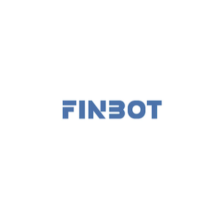
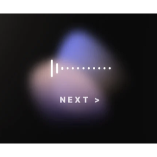
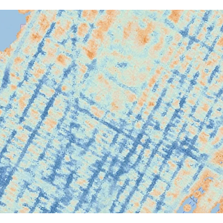

### ✨ Projects

<table>
  <tr>
    <td align="center" width="20%">
      
    </td>
    <td align="center" width="20%">
      
    </td>
    <td align="center" width="20%">
      
    </td>
    <td align="center" width="20%">
      
    </td>
    <td align="center" width="20%">
      
    </td>
  </tr>
  <tr>
    <td align="center"><strong>Finbot</strong></td>
    <td align="center"><strong>Lipew</strong></td>
    <td align="center"><strong>PammaP</strong></td>
    <td align="center"><strong>The Interview</strong></td>
    <td align="center"><strong>NAIS</strong></td>
  </tr>
  <tr>
    <td align="center">AI 금융 상품 추천</td>
    <td align="center">퍼스널 컬러 기반 AI 립 제품 추천</td>
    <td align="center">실시간 모바일 축제 팜플릿</td>
    <td align="center">자기탐색형 AI 인터뷰</td>
    <td align="center">AI 예측 결과 대시보드</td>
  </tr>
</table>

 

### 💻 Tech Stack

| Category          | Stack                                                                                                                                                                                                                                                                                                                                                                                                                                                                                                                                                                                                                                                             |
| ----------------- | ----------------------------------------------------------------------------------------------------------------------------------------------------------------------------------------------------------------------------------------------------------------------------------------------------------------------------------------------------------------------------------------------------------------------------------------------------------------------------------------------------------------------------------------------------------------------------------------------------------------------------------------------------------------- |
| **Language**      |                                                                                                                                                                                                                                                                                                         |
| **Frontend**      |                                                                                                                                                                                                                      |
| **UI · Styling**  |                                                                                                                                                                                                                                                                                              |
| **Backend**       |                                                                                                                                                                                                                                                                                                                                                                                                                                                                                                                                                                       |
| **Collaboration** |       |

 

  

